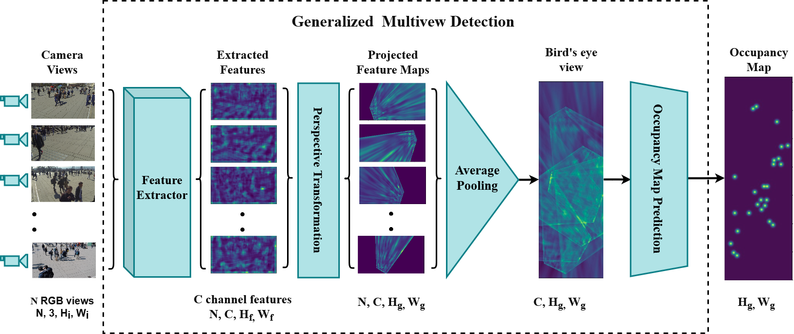

# Bringing Generalization to Deep Multi-view Detection


## Abstract
Multi-view Detection (MVD) is highly effective for occlusion reasoning and is a
mainstream solution in various applications that require accurate top-view occupancy
maps. While recent works using deep learning have made significant advances in the
field, they have overlooked the generalization aspect, which makes them impractical
for real-world deployment. The key novelty of our work is to formalize three critical
forms of generalization and propose experiments to investigate them: i) generalization
across a varying number of cameras, ii) generalization with varying camera positions,
and finally, iii) generalization to new scenes. We find that existing state-of-the-art models
show poor generalization by overfitting to a single scene and camera configuration. We
propose modifications in terms of pre-training, pooling strategy, regularization, and loss
function to an existing state-of-the-art framework, leading to successful generalization
across new camera configurations and new scenes. We perform a comprehensive set of
experiments on the WildTrack and MultiViewX datasets to (a) motivate the necessity to
evaluate MVD methods on generalization abilities and (b) demonstrate the efficacy of
the proposed approach.

## Architecture


## Dataset
* Wildtrack Dataset can be downloaded from this [link](https://www.epfl.ch/labs/cvlab/data/data-wildtrack/).
* MultiviewX Dataset can be downloaded from this [link](https://github.com/hou-yz/MultiviewX).

## Results

* ### DHF1K
```math
\begin{table}[t]
\begin{center}
\resizebox{\textwidth}{!}{%
\begin{tabular}{@{}cc|cccc|cccc@{}}
\toprule
\multirow{2}{*}{\textbf{Method}} &
  \multirow{2}{*}{\textbf{\begin{tabular}[c]{@{}c@{}}ImageNet\\ (pre-train)\end{tabular}}} &
  \multicolumn{4}{c|}{\textbf{\wildtrack}} &
  \multicolumn{4}{c}{\textbf{\multiviewx}} \\ \cmidrule(l){3-10} 
                 &     & \textbf{MODA}  & \textbf{MODP}  & \textbf{Prec}  & \textbf{Recall} & \textbf{MODA}  & \textbf{MODP}  & \textbf{Prec}  & \textbf{Recall} \\ \midrule
RCNN  Clustering~\cite{xu2016multi} &  $\times$   & 11.3           & 18.4           & 68             & 43              & 18.7           & 46.4           & 63.5           & 43.9            \\
POM-CNN\cite{Fleuret2008MulticameraPT}          &   $\times$  & 23.2           & 30.5           & 75             & 55              & -              & -              & -              & -               \\
Lopez-Cifuentes \etal~\cite{LpezCifuentes2018SemanticDM}    &  $\times$   & 39.0           & 55.0           & -          & -          & -              & -              & -              & -               \\
Lima \etal~\cite{Lima2021GeneralizableM3}      &  $\times$   & 56.9           & 67.3           & 80.8           & 74.6            & -              & -              & -              & -               \\
DeepMCD\cite{Chavdarova2017DeepMP}          &  $\times$   & 67.8           & 64.2           & 85             & 82              & 70.0           & 73.0           & 85.7           & 83.3            \\
Deep-Occlusion \cite{Baqu2017DeepOR}  &  $\times$   & 74.1           & 53.8           & 95             & 80              & 75.2           & 54.7           & 97.8           & 80.2            \\
MVDet\cite{hou2020multiview}            &   $\times$  & 88.2           & 75.7           & 94.7           & 93.6            & 83.9           & 79.6           & 96.8           & 86.7            \\
MVDet(Our Implementation)            &   $\times$  & 88.1($\pm$0.8) & 75.1($\pm$0.4) & 93.8($\pm$0.9) & 94.3($\pm$0.6)  & 83.3($\pm$0.6) & 79.3($\pm$0.3) & 96.9($\pm$0.6) & 86.1 ($\pm$0.6) \\ \midrule
MVDet + KLCC     &  $\times$   & \textbf{89.3}($\pm$0.8) & 75.1($\pm$0.2) & 94.7($\pm$0.8) & 94.6($\pm$0.6)  & 85.3($\pm$0.2) & 79.4($\pm$0.2) & 96.5($\pm$0.4) & 88.5($\pm$0.3)  \\
MVDet + KLCC     & \checkmark & 87.9($\pm$0.8) & 76.1($\pm$0.2) & 92.7($\pm$0.6) & \textbf{95.4}($\pm$0.4)  & \textbf{90.3}($\pm$0.2) & \textbf{82.6}($\pm$0.1) & 97.0($\pm$0.2) & \textbf{93.1}($\pm$0.3)  \\
Ours             &  $\times$   & 87.2($\pm$0.6) & 74.5($\pm$0.4) & 93.8($\pm$1.6) & 93.4($\pm$1.8)  & 78.6($\pm$0.9) & 78.1($\pm$0.4) & 96.8($\pm$0.5) & 81.3($\pm$0.9)  \\

Ours(DropView) & \checkmark & 86.7($\pm$0.4) & 76.2($\pm$0.2) & 95.1($\pm$0.3) & 91.4($\pm$0.6) & 88.2($\pm$0.1) & 79.9($\pm$0.0) & 96.8($\pm$0.2) & 91.2($\pm$0.1) \\

Ours             & \checkmark & 85.4($\pm$0.4) & \textbf{76.7}($\pm$0.2) & \textbf{95.2}($\pm$0.4) & 89.9($\pm$0.8)  & 86.9($\pm$0.2) & 79.8($\pm$0.1) & \textbf{97.2}($\pm$0.2) & 89.6($\pm$0.2)  \\ \bottomrule
\end{tabular}%
}
\end{center}
\caption{Comparison against the \sota methods. Our method refers to the proposed model in Section~\ref{sec:method}. We made five runs for some of the experiments and the variances are presented in the bracket.}
\label{tab:sota_table}
\end{table}
```
